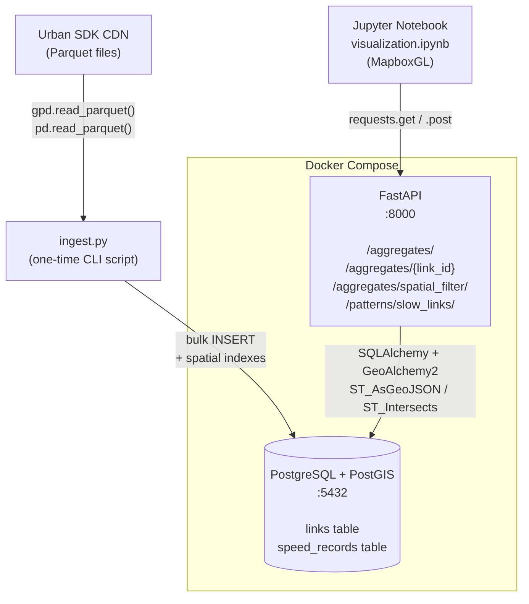

# Urban SDK — Geospatial Traffic API

Senior Python Engineer take-home project. A FastAPI microservice that ingests traffic speed data for Duval County, FL, stores it in PostgreSQL + PostGIS, and exposes RESTful endpoints for spatial and temporal aggregation. Results are visualized via MapboxGL in a Jupyter notebook.

---

## Architecture



---

## Project Structure

```
usdk_se_API/
├── app/                          # FastAPI microservice
│   ├── docker-compose.yml        # PostgreSQL + PostGIS + API orchestration
│   ├── Dockerfile
│   ├── requirements.txt
│   ├── .env.example
│   └── src/
│       ├── main.py               # FastAPI app, lifespan, router includes
│       ├── database.py           # SQLAlchemy engine, session, init_db()
│       ├── models.py             # Link and SpeedRecord ORM models
│       ├── schemas.py            # Pydantic request/response schemas
│       ├── routers/
│       │   ├── aggregates.py     # /aggregates/ endpoints (1, 2, 4)
│       │   └── patterns.py       # /patterns/slow_links/ endpoint (3)
│       └── scripts/
│           └── ingest.py         # One-time data ingestion CLI
├── analytics/
│   ├── requirements.txt          # Notebook dependencies
│   └── visualization.ipynb       # MapboxGL visualization notebook
└── README.md
```

---

## Quick Start

### 1. Start the services

```bash
cd app
cp .env.example .env
docker-compose up --build -d

# Wait for both services to be healthy
docker-compose ps
```

### 2. Ingest data

Downloads ~350MB of Parquet files from the Urban SDK CDN and loads them into PostgreSQL.

```bash
docker-compose exec api python -m src.scripts.ingest
```

Expected output:
```
INFO Initializing database schema...
INFO Downloading link info from: https://cdn.urbansdk.com/...
INFO   Loaded N links | columns: [link_id, road_name, length, geometry]
INFO Downloading speed data from: https://cdn.urbansdk.com/...
INFO   Loaded M speed records | columns: [link_id, timestamp, speed, ...]
INFO Inserted N link records
INFO Inserted M speed records total
INFO Indexes created
INFO Ingestion complete.
```

### 3. Test the API

```bash
# Health check
curl http://localhost:8000/health

# All segments — Monday AM Peak
curl "http://localhost:8000/aggregates/?day=Monday&period=AM+Peak" | python -m json.tool | head -60

# Single segment
curl "http://localhost:8000/aggregates/LINK_ID_HERE?day=Monday&period=AM+Peak"

# Spatial filter — downtown Jacksonville
curl -X POST http://localhost:8000/aggregates/spatial_filter/ \
  -H "Content-Type: application/json" \
  -d '{"day":"Monday","period":"AM Peak","bbox":[-81.70,30.30,-81.60,30.40]}'

# Slow links pattern
curl "http://localhost:8000/patterns/slow_links/?period=AM+Peak&threshold=25&min_days=1"

# Interactive API docs
open http://localhost:8000/docs
```

### 4. Run the notebook

```bash
cd analytics
python -m venv .venv && source .venv/bin/activate
pip install -r requirements.txt
jupyter notebook visualization.ipynb
```

Open `visualization.ipynb`, set `MAPBOX_TOKEN` in Cell 1, and run all cells.

---

## API Endpoints

| Method | Endpoint | Params | Description |
|--------|----------|--------|-------------|
| GET | `/aggregates/` | `day`, `period` | Avg speed per link for day + period |
| GET | `/aggregates/{link_id}` | `day`, `period` | Single segment speed + metadata |
| POST | `/aggregates/spatial_filter/` | body: `day`, `period`, `bbox` | Segments intersecting bounding box |
| GET | `/patterns/slow_links/` | `period`, `threshold`, `min_days` | Chronically slow links |
| GET | `/health` | — | Service health check |

### Time Periods

| ID | Name | Hours |
|----|------|-------|
| 1 | Overnight | 00:00–03:59 |
| 2 | Early Morning | 04:00–06:59 |
| 3 | AM Peak | 07:00–09:59 |
| 4 | Midday | 10:00–12:59 |
| 5 | Early Afternoon | 13:00–15:59 |
| 6 | PM Peak | 16:00–18:59 |
| 7 | Evening | 19:00–23:59 |

---

## Technical Decisions

| Decision | Choice | Rationale |
|----------|--------|-----------|
| `day_of_week` + `period_id` storage | Pre-computed integers at ingest time | Enables composite B-tree index; avoids runtime timestamp parsing at query time |
| GeoJSON serialization | `ST_AsGeoJSON()::text` in SQL SELECT | All geometry work stays in PostGIS; Pydantic validator parses the returned string |
| ORM vs raw SQL | Hybrid — ORM owns schema, `text()` for queries | Spatial + aggregate queries are cleaner as SQL; ORM manages table creation |
| Spatial filter | `ST_Intersects` + `ST_MakeEnvelope` | Standard PostGIS bbox pattern; leverages GiST index automatically |
| Index strategy | GiST on `links.geometry`, B-tree on `(link_id, day_of_week, period_id)` and `(day_of_week, period_id)` | Created after bulk load; covers both single-link and cross-link query patterns |
| Docker healthcheck | `pg_isready` on db; api `depends_on: service_healthy` | Prevents api startup before PostGIS is accepting connections |

---

## Data Sources

- **Link Info**: `link_info.parquet.gz` — road segment geometries (LINESTRING, EPSG:4326)
- **Speed Data**: `duval_jan1_2024.parquet.gz` — speed readings for Duval County, Jan 1 2024 (Monday)

Both datasets are from the [Urban SDK CDN](https://cdn.urbansdk.com/data-engineering-interview/).
